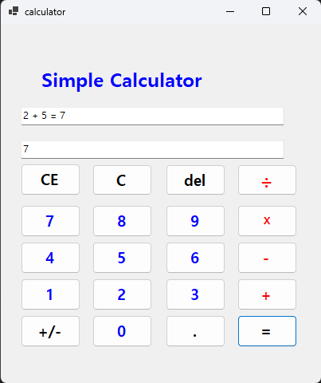

# (C# 코딩) 에코메신저
## 개요
-C# 프로그래밍학습
-1줄소개: 클릭하면 입력 값을 받고 계산을 해주는 게산기
-사용한플랫폼: 
-C#, .NET Windows Forms, Visual Studio, GitHub
-사용한컨트롤:-Label, TextBox, Button
-사용한기술과구현한기능:-Visual Studio를이용하여UI 디자인
-수업중에배우고사용했던클래스들관련된설명--
-실습중에구현한기능들설명--

## 실행화면(과제1)
-과제1코드의실행스크린샷

-과제내용-Label(표시), TextBox(입력), Button(전송), ListBox(대화창)를적절히배치합니다.

-전송버튼클릭시TextBox의텍스트를ListBox의항목(Items)으로추가합니다.

-추가직후TextBox의내용을비워(Clear) 다음입력을준비합니다.

-구현내용과기능설명-입력창에메시지입력하고전송버튼을누르면메시지가리스트박스에표시된다.

-계속반복하면메시지가리스트박스에한줄씩계속추가된다.

-추가내용이많아지면리스트박스에스크롤바가자동으로생기고스크롤된다.